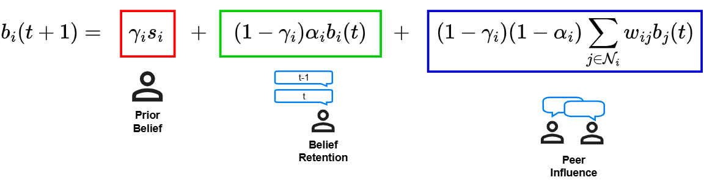

## Robustness of agentic networks

This repo is a collection of learning resources from [The Rise of Agentic Networks - Risks in Collaboration Seminar](https://cms.cispa.saarland/rml26/) held at UdS x CISPA Summer Semester 2026. 

Main paper covered are:
 - ["Don't Trust Stubborn Neighbors: A Security Framework for Agentic Networks"](https://arxiv.org/abs/2603.15809) by Abedini et al. 2026.
 - ["NetSafe: Exploring the Topological Safety of Multi-agent Networks"](https://arxiv.org/abs/2410.15686) by Yu et al. 2024.

# The Rise of Agentic Networks

## Introduction

// todo

In recent years, the as AI agents becoming more specialized, this leads to  the deployment of Multi-Agent System to be the preferred method.

We will look at how this agent behave with one another and take a deeper look into the robustness of agentic networks.

### Friedkin-Johnson Opinion Formation Model

How does one model a person belief and opinion?

#### Stubborness

If a person stubborn, no matter what other people say, their belief will stay the same. This stubborness represented as $\gamma$.

#### How quickly belief change

A person might slowly over time change their belief. This momentum of change is represented as $\alpha$. An extreme example would be when $\alpha = 1$, whathever new formation take place, we immediately adopts that.

#### Peer Influence

#### Example 1 Attacker, 5 Benign

